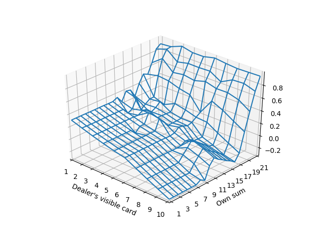

# Easy21

This repository contains my solutions for David Silver's Reinforcement Learning course assignment, Easy21. I did not attend the course, but I watched it on youtube. I highly recommend it. All the material can be found [here][linkOrigMaterial]. Easy21 is a simplified version of Blackjack card game.

[linkOrigMaterial]: http://www0.cs.ucl.ac.uk/staff/D.Silver/web/Teaching.html

My code structure is not as pretty as it could be, it is quite obvious that I lack the corresponding formal background. Only when looking at other peoples' solutions I noticed what is probably the standard way to structure agents and environments. But I left comments in the code so it should be easy to follow.

* _common.py_ contains the environment, mainly the game stepping function
* _monteCarlo.py_ contains the solution for Monte Carlo control
* _QFromMonteCarlo.npy_ contains the action value function Q obtained by Monte Carlo, used as a reference for SARSA
* _sarsa.py_ contains the solution for SARSA(lambda)
* _sarsaApprox.py_ contains the solution for SARSA(lambda) with linear value function approximation

Here is max(Q) obtained by Monte Carlo control after 100000000 epizodes:

Here is MSE (mean squared error) of Q obtained by SARSA versus number of episodes:

Here is an example of max(Q) obtained by SARSA(0.5) after 50000 epizodes:

Below is MSE of Q obtained by SARSA with approximation versus number of episodes. The values converge quite faster than with pure SARSA, but MSE stays higher, because the approximating function is too simple.

Here is an example of max(Q) obtained by SARSA(0.5) with approximation after 2000 episodes:

